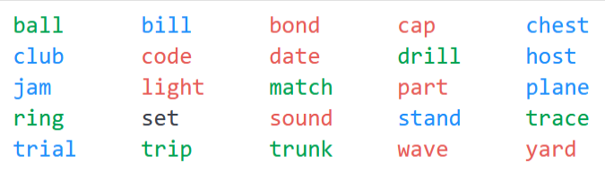

# Codename Hints

This is a small fun project to explore automatic ways to give hints in the famous card game [**Codenames**](https://czechgames.com/en/codenames/).

However, it can also be used to implement your own strategies or to get ideas in a running game.

The notebook demonstrates how the package can be used.

# Setup

Requirements:

* [`poetry >= 2.0`](https://python-poetry.org/docs/)
* `python >= 3.12`
* a CUDA compatible machine makes the `transformer` part much quicker
  * the `torch` dependency in pyproject.toml is compatible with CUDA 12.6
  * otherwise, it may be necessary to adapt the `torch` dependency specification

```bash
# set up a virtual environment
poetry install

# host the notebook locally
poetry run jupyter notebook
```

# The Game

(*In my words, may be incomplete or inaccurate, but this is the important part for giving the hints*).

The game is played in two teams, red and blue.
All players see a grid of 5 x 5 words.
These words often have multiple meanings.

One player of each team (the "boss") gets a map that shows which words belong to which category:
* 9 x color of starting team (here: red)
* 8 x color of other team (here: blue)
* 7 x neutral (green)
* 1 x assassin (black)




The boss may only pass information with a single word and a number.
For example, in this game, `signal + 4` may be a good hint for the red team to identify `light`,  `sound`, `wave` and `code`.

The other players guess one word after the other. After each guess, the category is revealed:
* teams' color: success. the team may make another guess
* other teams' color, neutral: stop. now the other team gets a hint and a number and starts guessing
* assassin: immediately lose the game

The team that identifies all words ("agents") of their color first, wins the game.

A good hint must target many words of the own team, while it must not evoke associations to words of the other categories, in particular not of the other team, or even the assassin!